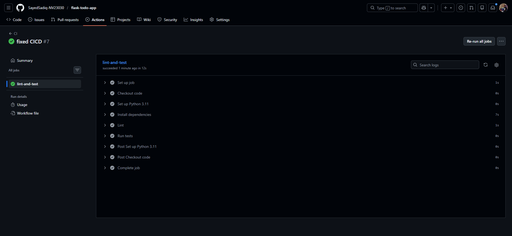
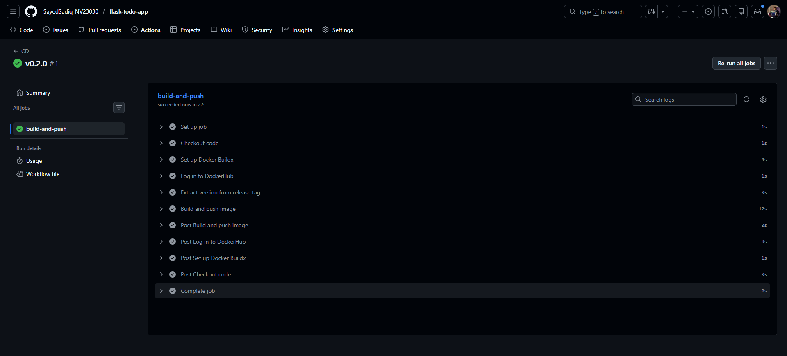
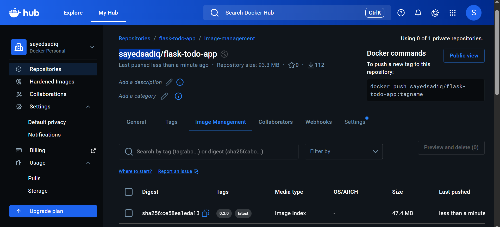
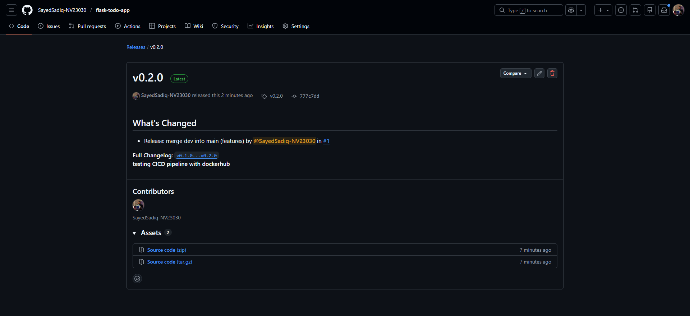

# CI/CD Submission - ToDo App

**Student Name:** Sayed Sadiq  
**Date:** March 8, 2026  
**Course:** CC302

---

## Table of Contents
1. [CI Workflow (ci.yml)](#ci-workflow-ciyml)
2. [CD Workflow (cd.yml)](#cd-workflow-cdyml)
3. [Docker Image on DockerHub](#docker-image-on-dockerhub)
4. [GitHub Release](#github-release)
5. [Reflection: What I Learned](#reflection-what-i-learned)

---

## CI Workflow (ci.yml)

### Workflow File

The CI pipeline runs on every push and pull request to the `main` and `dev` branches. It installs dependencies, runs flake8 linting, and executes pytest tests.

**File Location:** `.github/workflows/ci.yml`

```yaml
name: CI

on:
  push:
    branches: [main, dev]
  pull_request:
    branches: [main, dev]

jobs:
  lint-and-test:
    runs-on: ubuntu-latest

    steps:
      - name: Checkout code
        uses: actions/checkout@v4

      - name: Set up Python 3.11
        uses: actions/setup-python@v5
        with:
          python-version: '3.11'

      - name: Install dependencies
        run: |
          python -m pip install --upgrade pip
          pip install -r requirements.txt

      - name: Lint
        run: flake8 . --count --max-line-length=120 --statistics

      - name: Run tests
        run: pytest tests/ -v
```

### Screenshot of Successful CI Run



**Description:** The screenshots above show a successful CI workflow run where linting passed and all pytest tests completed successfully.

### Verification Notes

- The workflow file exists at `.github/workflows/ci.yml`.
- The workflow runs on both `push` and `pull_request` for `dev` and `main`.
- The current GitHub Actions workflow name is `CI`.
- The job name shown in GitHub Actions is `lint-and-test`.

---

## CD Workflow (cd.yml)

### Workflow File

The CD pipeline is triggered when a new GitHub release is published. It builds a Docker image, extracts the version from the release tag, and pushes both version and `latest` tags to DockerHub.

**File Location:** `.github/workflows/cd.yml`

```yaml
name: CD

on:
  release:
    types: [published]

jobs:
  build-and-push:
    runs-on: ubuntu-latest

    steps:
      - name: Checkout code
        uses: actions/checkout@v4

      - name: Set up Docker Buildx
        uses: docker/setup-buildx-action@v3

      - name: Log in to DockerHub
        uses: docker/login-action@v3
        with:
          username: ${{ secrets.DOCKERHUB_USERNAME }}
          password: ${{ secrets.DOCKERHUB_TOKEN }}

      - name: Extract version from release tag
        id: version
        run: |
          TAG="${{ github.event.release.tag_name }}"
          VERSION="${TAG#v}"
          echo "version=$VERSION" >> "$GITHUB_OUTPUT"

      - name: Build and push image
        uses: docker/build-push-action@v5
        with:
          context: .
          push: true
          tags: |
            ${{ secrets.DOCKERHUB_USERNAME }}/flask-todo-app:${{ steps.version.outputs.version }}
            ${{ secrets.DOCKERHUB_USERNAME }}/flask-todo-app:latest
```

### Screenshot of Successful CD Run



**Description:** The screenshots above show a successful CD workflow run triggered by a published release, with the Docker image built and pushed to DockerHub.

---

## Docker Image on DockerHub

### Screenshot of DockerHub Repository



**Description:** The screenshot above shows DockerHub image tags pushed by the CD workflow, including the release version tag and `latest`.

**DockerHub Repository:** `sayedsadiq/flask-todo-app`

---

## GitHub Release

### Screenshot of GitHub Release



**Description:** The screenshot above shows the release page with a version tag (for example `v0.2.0`) that triggered the CD workflow.

---

## Reflection: What I Learned

### GitHub Actions and Automation

Through this project, I gained practical experience implementing CI/CD with GitHub Actions. I learned how to automate quality checks so that linting and tests run on every push and pull request to key branches. I also learned how release-driven deployment works by building and pushing Docker images automatically when a release is published. Using GitHub Secrets for DockerHub authentication reinforced secure credential management practices. Overall, this workflow improved reliability and reduced manual deployment effort.

---
## Additional Notes

### Repository Information
- **Repository:** `SayedSadiq-NV23030/flask-todo-app`
- **Branch Structure:** `main` (production), `dev` (development)
- **CI Triggers:** Push and pull requests to `main` and `dev`
- **CD Trigger:** Published GitHub releases

### Technologies Used
- **CI/CD Platform:** GitHub Actions
- **Testing Framework:** pytest
- **Linting:** flake8
- **Containerization:** Docker
- **Container Registry:** DockerHub
- **Programming Language:** Python 3.11 (CI workflow)
- **Application Framework:** Flask
