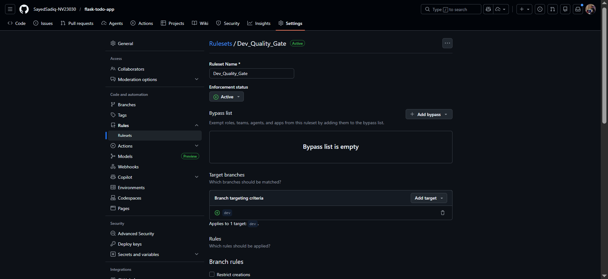
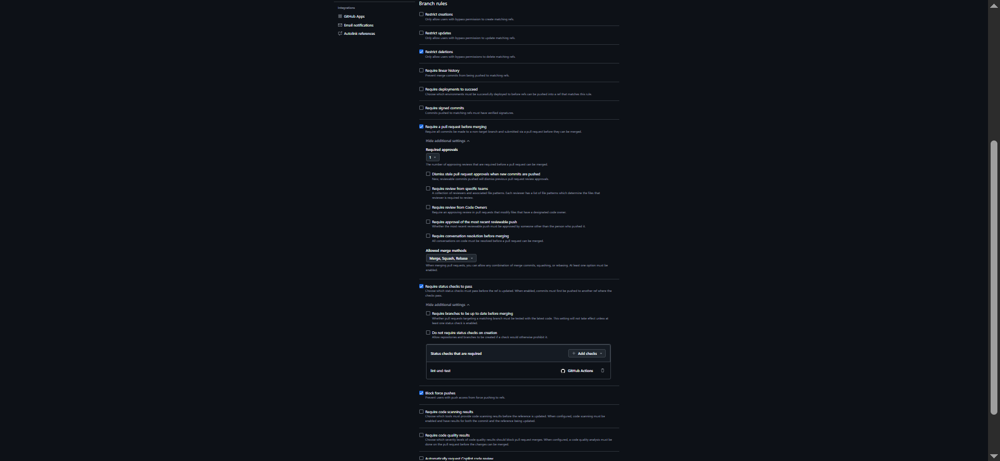
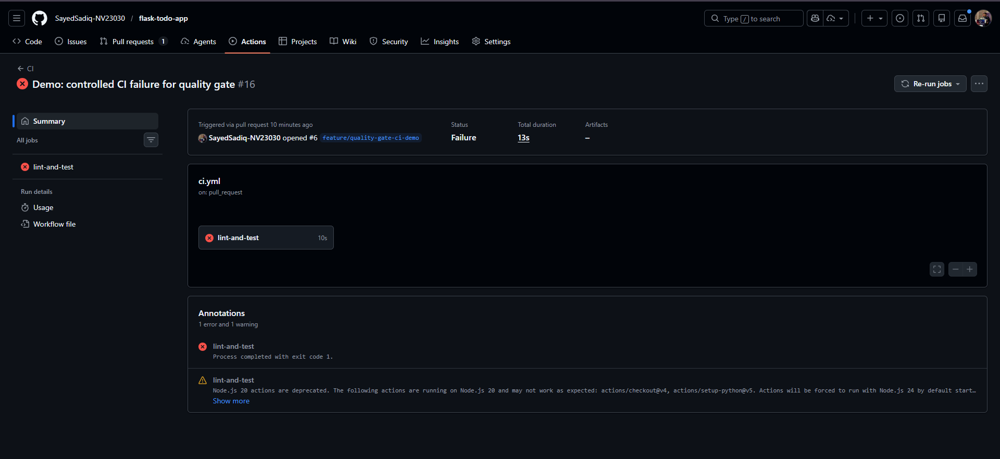
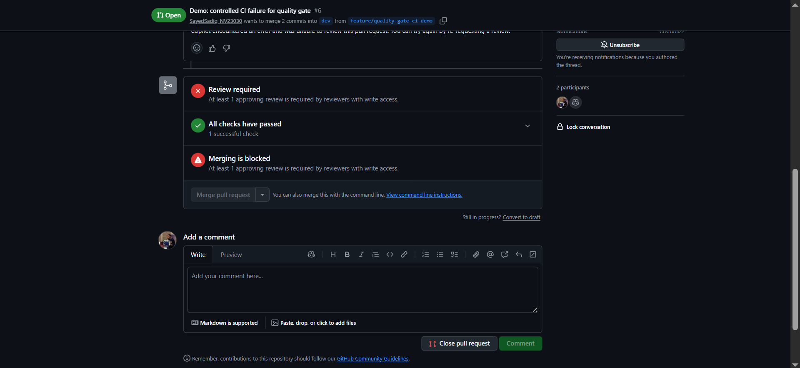
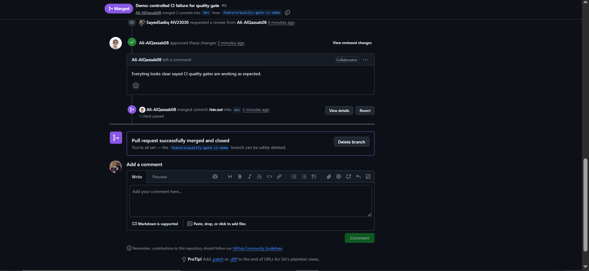

# Implementing Quality Gates (CI)

## Purpose

This document captures the branch protection setup and the evidence required to prove that CI quality gates are working correctly for the repository.

## Required Branch Rules

Set branch protection on `dev` first and then `main`.

For each protected branch, enable the following in GitHub:

- Require a pull request before merging
- Require status checks to pass before merging
- Select the CI check shown by GitHub Actions

If GitHub shows the job by job name, select `lint-and-test`.
If GitHub shows workflow and job together, select `CI / lint-and-test`.

## Recommended Setup Order

1. Protect `dev`
2. Test the quality gate with a feature branch PR into `dev`
3. Protect `main` after confirming the `dev` rule works correctly

## Controlled Fail -> Block -> Fix -> Pass Demonstration

To prove the gate works, use a safe temporary test failure from `tests/test_crud.py`.

Suggested demo change:

```python
def test_create_task(client):
    resp = client.post('/tasks', json={'title': 'Buy milk'})
    assert resp.status_code == 200
```

This should fail because the application correctly returns `201` for task creation.

Demonstration sequence:

1. Create a feature branch from `dev`
2. Change one assertion to force CI to fail
3. Commit and push the branch
4. Open a pull request into `dev`
5. Confirm the PR is blocked because the required check failed
6. Restore the correct assertion `assert resp.status_code == 201`
7. Push again to the same PR branch
8. Confirm CI passes and merge becomes available

## Evidence Pack Checklist

The final submission should include these items in one zip file:

- Screenshot of the `dev` or `main` branch rule showing pull request required
- Screenshot of the `dev` or `main` branch rule showing required status checks enabled
- Screenshot of a PR blocked by failed CI
- Screenshot of the same PR after CI passes and merge is allowed
- PR link for feature branch to `dev`
- Short explanation of what failed, why merge was blocked, and what was fixed

## Submitted Evidence (Screenshots)

### 1. Branch protection or ruleset for `dev`

Shows ruleset targeting `dev`.



Shows pull request required and required status checks configured.



### 2. PR blocked due to failed CI (red)

Failed CI run (`lint-and-test`) for the demo PR.



PR status showing merge blocked while review is required and checks are part of gating.



### 3. PR passing CI (green)

Successful CI run after fixing the controlled failure.



### 4. PR link

- https://github.com/SayedSadiq-NV23030/flask-todo-app/pull/6

## Short Reflection


```text
I intentionally changed one test assertion in test_create_task so that CI would fail.
The pull request into dev was blocked because the required status check did not pass.
GitHub branch protection prevented the merge until the CI job succeeded.
I then restored the correct expected status code from 200 back to 201.
After pushing the fix, the CI workflow passed successfully.
Once the required check was green, GitHub allowed the PR to be merged.
This demonstrated that the quality gate was working correctly.
```