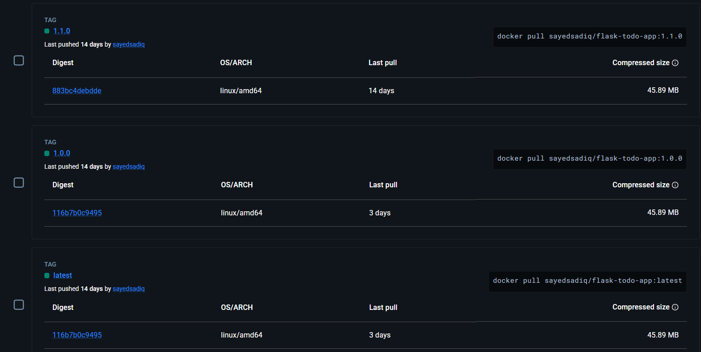

# Flask Todo App - Branching & Release Assignment Submission

**Student:** Sayed Sadiq  
**Date:** February 22, 2026

---

## Part A: Branch List

**git branch -a output:**

```
  dev
  feature/filters-sorting
  feature/pr-task-descriptions
  feature/search
  feature/task-descriptions
  main
  remotes/origin/HEAD -> origin/main
  remotes/origin/dev
  remotes/origin/feature/filters-sorting
  remotes/origin/feature/pr-task-descriptions
  remotes/origin/feature/search
  remotes/origin/feature/task-descriptions
  remotes/origin/main
```

---

## Part B: Feature PRs (feature → dev)

**PR #2: Task Descriptions Feature**
- Link: https://github.com/SayedSadiq-NV23030/flask-todo-app/pull/2
- Branch: `feature/task-descriptions` → `dev`
- Status: ✓ Merged

**PR #3: Search Feature**
- Link: https://github.com/SayedSadiq-NV23030/flask-todo-app/pull/3
- Branch: `feature/search` → `dev`
- Status: ✓ Merged

**PR #4: Filters & Sorting Feature**
- Link: https://github.com/SayedSadiq-NV23030/flask-todo-app/pull/4
- Branch: `feature/filters-sorting` → `dev`
- Status: ✓ Merged

---

## Part C: Release PR (dev → main)

**Release PR:**
- Link: https://github.com/SayedSadiq-NV23030/flask-todo-app/pull/1
- Description: Merged all features from dev into main for v0.1.0 release
- Status: ✓ Merged

---

## Part D: Docker Hub

**DockerHub Repository & Tags:**



**Commands to build and push:**
```bash
docker build -t sayedsadiq/todo-saas:1.1.0 .
docker push sayedsadiq/todo-saas:1.1.0
docker tag sayedsadiq/todo-saas:1.1.0 sayedsadiq/todo-saas:latest
docker push sayedsadiq/todo-saas:latest
```

---

## Part E: GitHub Release

**Release Link:** https://github.com/SayedSadiq-NV23030/flask-todo-app/releases/tag/v1.1.0

**Tag:** `v1.1.0`

**Release Notes:**
```
Release v1.1.0

Features Implemented:
- Task Descriptions and Metadata Support
- Advanced Search Functionality
- Filters and Sorting Capabilities
- Light/Dark Theme Toggle
- Service Worker & Offline Support
```

---

## Part F: Learning Summary

### What I learned about branching and merging:

Branching and merging are essential patterns for managing code in a team environment and maintaining code quality. Through this assignment, I gained hands-on experience with Git workflows and learned that a three-tier branching strategy (`main` → `dev` → `feature`) significantly reduces merge conflicts and deployment risks. Feature branches enable developers to work independently without disrupting the main codebase, while the `dev` branch serves as a testing ground where all features are integrated and validated before being released to production. Pull requests are invaluable tools that enforce code review, maintain a clear history of changes, and ensure quality standards are met before integration. I also learned how semantic versioning (v0.1.0) combined with Git tags and GitHub releases creates a predictable release process and makes it easy to trace which features are in which versions. Docker containerization ties everything together by ensuring the same environment is used from development through production, and tagging images with version numbers makes rollbacks straightforward and dependency tracking clear.

---

## Checklist

- [x] Create `dev` branch from `main` and push
- [x] Create 3 feature branches from `dev` and push
- [x] Implement features and commit/push to feature branches
- [x] Open 3 PRs (feature → dev) and merge
- [x] Open 1 PR (dev → main) and merge
- [x] Build & push Docker images (`1.1.0` and `latest`)
- [x] Create Git tag `v1.1.0` and GitHub release
- [x] Prepare submission document

---

