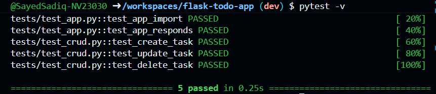

# Testing Operations Documentation

## Assignment Scope

This document records the full testing work completed for the Flask ToDo CRUD assignment using pytest and Flask test client.

Required goals:

1. Create automated tests for Create, Read, Update, Delete.
2. Include at least one Read or verify step.
3. Run tests successfully (green).
4. Demonstrate one intentional failure (red), then fix and return to green.

## Environment and Tools

1. Framework: Flask 3.0.0
2. Test runner: pytest 7.4.3
3. Platform: Linux

Dependency check:

- requirements.txt already included pytest.

## What Was Implemented

### 1) Backend CRUD Support for Testability

The original app supported add and delete through form routes but did not provide a complete API CRUD surface or update route. To enable deterministic automated CRUD testing, the following routes were implemented in app/routes.py:

1. POST /update/<idx> for form-based update flow
2. GET /tasks for list or read verification
3. POST /tasks for create
4. PUT /tasks/<task_id> for update
5. DELETE /tasks/<task_id> for delete

Also, todo file handling was improved using a stable absolute path to todos.json.

Code excerpt:

```python
from flask import Blueprint, jsonify, render_template, request, redirect, url_for
import json
from pathlib import Path

todo_routes = Blueprint('todo_routes', __name__)

TODO_FILE = Path(__file__).resolve().parent.parent / 'todos.json'

def load_todos():
	try:
		with open(TODO_FILE, 'r') as f:
			return json.load(f)
	except FileNotFoundError:
		return []

def save_todos(todos):
	with open(TODO_FILE, 'w') as f:
		json.dump(todos, f)

@todo_routes.route('/tasks', methods=['GET'])
def list_tasks():
	todos = load_todos()
	tasks = [{'id': idx, 'title': title} for idx, title in enumerate(todos)]
	return jsonify(tasks), 200

@todo_routes.route('/tasks', methods=['POST'])
def create_task():
	payload = request.get_json(silent=True) or {}
	title = (payload.get('title') or '').strip()
	if not title:
		return jsonify({'error': 'title is required'}), 400

	todos = load_todos()
	todos.append(title)
	save_todos(todos)
	return jsonify({'id': len(todos) - 1, 'title': title}), 201

@todo_routes.route('/tasks/<int:task_id>', methods=['PUT'])
def update_task(task_id):
	payload = request.get_json(silent=True) or {}
	title = (payload.get('title') or '').strip()
	if not title:
		return jsonify({'error': 'title is required'}), 400

	todos = load_todos()
	if not (0 <= task_id < len(todos)):
		return jsonify({'error': 'task not found'}), 404

	todos[task_id] = title
	save_todos(todos)
	return jsonify({'id': task_id, 'title': title}), 200

@todo_routes.route('/tasks/<int:task_id>', methods=['DELETE'])
def delete_task(task_id):
	todos = load_todos()
	if not (0 <= task_id < len(todos)):
		return jsonify({'error': 'task not found'}), 404

	deleted = todos.pop(task_id)
	save_todos(todos)
	return jsonify({'deleted': {'id': task_id, 'title': deleted}}), 200
```

### 2) CRUD Test Suite Added

New file: tests/test_crud.py

Implemented tests:

1. test_create_task
2. test_update_task
3. test_delete_task
4. test_app_import
5. test_app_responds

Each test follows AAA:

1. Arrange: initialize app client and starting data
2. Act: call the relevant CRUD endpoint
3. Assert: verify status code and content or list behavior

Each CRUD test includes Read or verify by calling GET /tasks and checking list content.

Code excerpt:

```python
import importlib.util
import json
import os

import pytest

ROOT = os.path.abspath(os.path.join(os.path.dirname(__file__), '..'))
APP_PY = os.path.join(ROOT, 'app.py')
TODOS = os.path.join(ROOT, 'todos.json')

spec = importlib.util.spec_from_file_location('app_main', APP_PY)
app_module = importlib.util.module_from_spec(spec)
spec.loader.exec_module(app_module)
flask_app = app_module.app

def _backup_file(path):
	if os.path.exists(path):
		with open(path, 'r') as f:
			return f.read()
	return None

def _restore_file(path, content):
	if content is None:
		try:
			os.remove(path)
		except FileNotFoundError:
			pass
	else:
		with open(path, 'w') as f:
			f.write(content)

@pytest.fixture
def client():
	original = _backup_file(TODOS)
	with open(TODOS, 'w') as f:
		json.dump([], f)

	flask_app.config['TESTING'] = True
	with flask_app.test_client() as test_client:
		yield test_client

	_restore_file(TODOS, original)

def test_create_task(client):
	resp = client.post('/tasks', json={'title': 'Buy milk'})
	assert resp.status_code == 201
	created = resp.get_json()
	assert created['title'] == 'Buy milk'

	listed = client.get('/tasks')
	assert listed.status_code == 200
	titles = [task['title'] for task in listed.get_json()]
	assert 'Buy milk' in titles

def test_update_task(client):
	created = client.post('/tasks', json={'title': 'Old title'})
	assert created.status_code == 201
	task_id = created.get_json()['id']

	updated = client.put(f'/tasks/{task_id}', json={'title': 'New title'})
	assert updated.status_code == 200
	assert updated.get_json()['title'] == 'New title'

	listed = client.get('/tasks')
	assert listed.status_code == 200
	titles = [task['title'] for task in listed.get_json()]
	assert 'New title' in titles
	assert 'Old title' not in titles

def test_delete_task(client):
	created = client.post('/tasks', json={'title': 'To be deleted'})
	assert created.status_code == 201
	task_id = created.get_json()['id']

	deleted = client.delete(f'/tasks/{task_id}')
	assert deleted.status_code == 200
	assert deleted.get_json()['deleted']['title'] == 'To be deleted'

	listed = client.get('/tasks')
	assert listed.status_code == 200
	titles = [task['title'] for task in listed.get_json()]
	assert 'To be deleted' not in titles
```

## Test Execution Commands

Install dependencies:

```bash
pip install -r requirements.txt
```

Run tests in verbose mode:

```bash
pytest -v
```

## Actual Verbose Output (pytest -v)

```text
============================= test session starts ==============================
platform linux -- Python 3.12.1, pytest-7.4.3, pluggy-1.6.0 -- /home/codespace/.python/current/bin/python3
cachedir: .pytest_cache
rootdir: /workspaces/flask-todo-app
plugins: anyio-4.11.0
collected 5 items

tests/test_app.py::test_app_import PASSED                                [ 20%]
tests/test_app.py::test_app_responds PASSED                              [ 40%]
tests/test_crud.py::test_create_task PASSED                              [ 60%]
tests/test_crud.py::test_update_task PASSED                              [ 80%]
tests/test_crud.py::test_delete_task PASSED                              [100%]

============================== 5 passed in 0.14s ===============================
```


## Intentional Failure Demonstration (Red) and Fix

To satisfy assignment requirement for one red run:

1. A temporary failing test was added: assert 1 == 2
2. Test run showed failure: 1 failed, 5 passed
3. Temporary failing test was removed
4. Test run returned to green: all tests passed

Failure output recorded during demonstration:

```text
.....F                                                                   [100%]
=================================== FAILURES ===================================
________________________ test_intentional_failure_demo _________________________

	def test_intentional_failure_demo():
>       assert 1 == 2
E       assert 1 == 2

tests/test_crud.py:108: AssertionError
=========================== short test summary info ============================
FAILED tests/test_crud.py::test_intentional_failure_demo - assert 1 == 2
1 failed, 5 passed in 0.48s
```

## Requirement Checklist

1. tests folder exists: Completed
2. At least 3 CRUD tests: Completed
3. Read or verify step included: Completed
4. Green run achieved: Completed
5. Red run and fix demonstrated: Completed
6. pytest installed in requirements: Completed

## Files Involved

1. app/routes.py
2. tests/test_crud.py
3. testing_operations.md
4. requirements.txt

